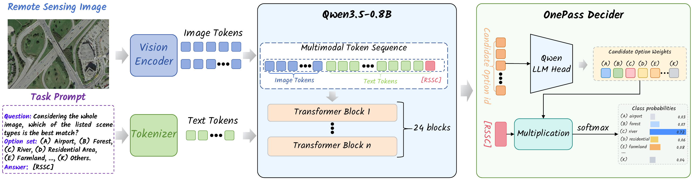
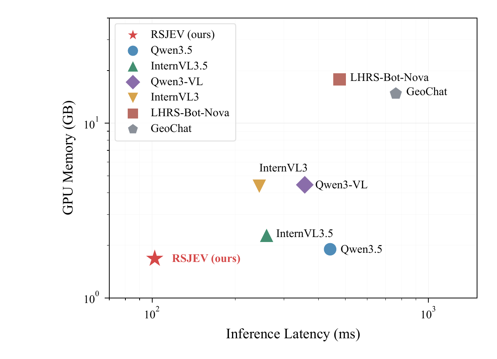
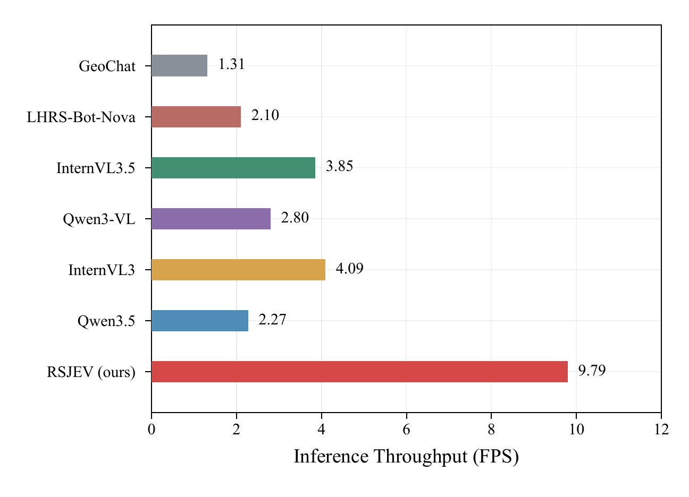

<div align="center">
  <h2><strong>RSJEV: Discriminative Remote Sensing Scene Classification with Multimodal Large Language Models</strong></h2>
  <p>
    <strong>Dongchen Si</strong><sup>1</sup>, 
    <strong>Di Wang</strong><sup>1,2,3,4</sup>, 
    <strong>Mingzhen Xu</strong><sup>1</sup>, 
    <strong>Jing Zhang</strong><sup>1,2</sup>, 
    <strong>Bo Du</strong><sup>1,2,3,4</sup>, 
    <strong>Liangpei Zhang</strong><sup>5</sup>
  </p>
  <p> 
    <sup>1</sup>School of Computer Science, Wuhan University, Wuhan 430072, China
    <br>
    <sup>2</sup>Zhongguancun Academy, Beijing 100094, China
    <br>
    <sup>3</sup>National Engineering Research Center for Multimedia Software,
    Wuhan University, Wuhan 430072, China
    <br>
    <sup>4</sup>Hubei Key Laboratory of Multimedia and Network Communication Engineering,
    Wuhan University, Wuhan 430072, China
    <br>
    <sup>5</sup>State Key Laboratory of Information Engineering in Surveying,
    Mapping and Remote Sensing, Wuhan University, Wuhan, Hubei 430079, China
    </p> 
</div>
<!-- <div align="center">
  <a href="https://www.arxiv.org/abs/2602.14201"></a>  
  <a href="https://huggingface.co/initiacms/GeoEyes"></a>
</div> -->

## 📚Contents

- [📚Contents](#contents)
- [🔍Overview](#overview)
- [🛠️Methodology](#️methodology)
- [🚀Evaluation](#evaluation)
  - [Inference efficiency](#inference-efficiency)
- [🔗Citation](#citation)

## 🔍Overview

RSJEV is a one-pass framework for remote sensing scene classification. It combines an image, a task instruction, and an explicit set of candidate scene categories in a multimodal model, then predicts a category directly. Its **OnePass Decider (OPD)** avoids autoregressive answer generation by scoring the candidate options from a single multimodal decision state.

## 🛠️Methodology



<p align="center"><strong>Figure 1. RSJEV and the OnePass Decider.</strong></p>

1. A remote sensing image and a prompt containing the classification question and candidate categories are processed by the multimodal backbone.
2. OPD reads the final-layer hidden state at the designated `[RSSC]` answer slot.
3. The pretrained language-model head scores the candidate option tokens. A softmax over those scores produces category probabilities and the highest-scoring option is selected.

The experiments use **Qwen3.5-0.8B** as the main backbone. Training combines label-smoothed cross-entropy with Brier-score regularization.

## 🚀Evaluation

The paper reports the following performance on three remote sensing scene classification benchmarks:

| Dataset | Classes | Training split | Overall accuracy | F1 score |
| --- | ---: | ---: | ---: | ---: |
| UC Merced Land Use (UCM) | 21 | 50% | **97.71%** | **97.72%** |
| Aerial Image Dataset (AID) | 30 | 20% | **96.56%** | **96.30%** |
| NWPU-RESISC45 (NWPU) | 45 | 20% | **94.59%** | **94.58%** |

These are the RSJEV results reported in Table I of the paper. The remaining images in each split are used for testing.

### Inference efficiency

On one NVIDIA A40 GPU, with batch size 1 and bfloat16 inference, the paper reports **102.18 ms per image**, **9.79 FPS**, and **1.68 GB GPU memory** for RSJEV. Measurements use 30 test images after a five-image warm-up.

<p align="center">
  
  
</p>

<p align="center"><strong>Figure 2. GPU memory and latency (left), Inference throughput (right).</strong></p>

<!-- See the [paper](paper/RSJEV.pdf) for the full methodology, baseline comparisons, and ablation studies. -->

## 🔗Citation

If you use RSJEV in your research, please cite:

```bibtex
@misc{si_rsjev,
  title  = {RSJEV: Discriminative Remote Sensing Scene Classification with Multimodal Large Language Models},
  author = {Si, Dongchen and Wang, Di and Xu, Mingzhen and Zhang, Jing and Du, Bo and Zhang, Liangpei},
  url    = {https://github.com/Dongtcs/RSJEV}
}
```
